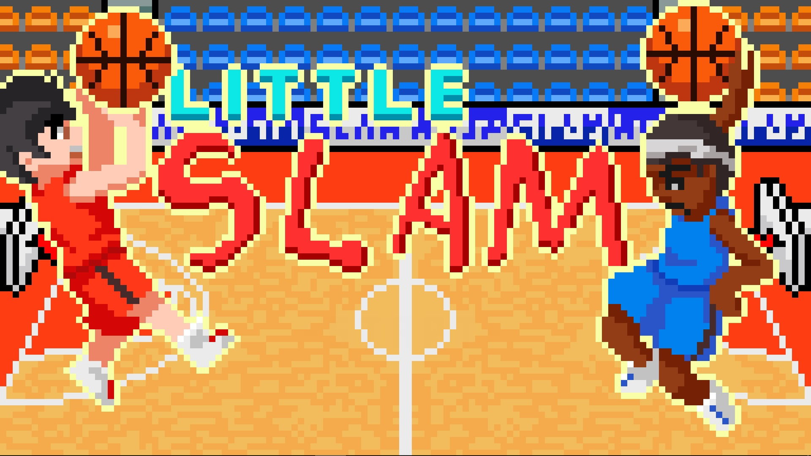
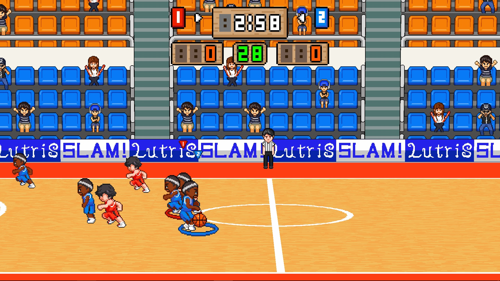

# Little Slam

inspired by [Super Slam](https://namu.wiki/w/%EC%8A%88%ED%8D%BC%EC%8A%AC%EB%9E%A8)

간단한 아케이드 농구 게임

[다운로드](https://github.com/jwvg0425/LittleSlam/releases/download/1.0/LittleSlam.zip)

  

[동영상](https://www.youtube.com/watch?v=woKWWQ2Hn1g&feature=youtu.be)

## 조작법

- 1p : wasd 이동, f - 슛 or 블락, g - 패스 or 스틸.
- 2p : ijkl 이동, ; - 슛 or 블락, ' - 패스 or 스틸.

키 설정은 처음에 게임 실행 시 유니티 런쳐에서 변경 가능합니다.

## License

게임 내에 사용된 모든 소스 코드 및 리소스는 상업적 용도를 포함하여 어떤 용도로든 아무런 제한 없이 자유롭게 사용/변형하셔도 됩니다.

단, 아래 소스 코드 및 리소스 파일은 해당 파일 원 제작자의 라이센스를 따릅니다.

### Source Code

- [Letter Spacing](https://bitbucket.org/AcornGame/adjustable-character-spacing)
- [StrongTags.unity](https://github.com/realityreflection/StrongTags.unity)

### Sound Files

- [sfx_throw.wav](https://opengameart.org/content/sfxthrow)
- [bounce.wav](http://freesound.org/people/andre.rocha.nascimento/sounds/51461/)
- [cheer1.wav](http://freesound.org/people/jayfrosting/sounds/333404/)
- [cheer2.ogg](http://freesound.org/people/BerlinGameScene/sounds/267248/)
- [title.ogg](https://opengameart.org/content/final-punch)
